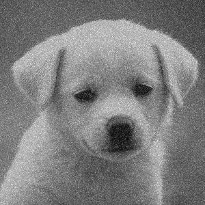

# 🚀 ClearVision - Image Processing for Defense  

### **Hacettepe University - BBM203 Software Practicum I - Fall 2024**  
**Course Project:** Implementing image processing techniques for defense applications, including image filtering and steganography.  

---

## 📌 Project Overview  
**ClearVision** is an advanced image processing tool, focusing on:  
✔️ **Image Enhancement:** Denoising, sharpening, and smoothing images using various filters.  
✔️ **Steganography:** Embedding and extracting secret messages using Least Significant Bit (LSB) manipulation.  
✔️ **Matrix Operations:** Storing images securely using **upper and lower triangular matrices**.  

# Example Images

---

## ⚙️ Features & Implementations  

### **1️⃣ Image Processing Filters**  
- 📌 **Mean Filter**: Smooths images by averaging pixel intensities.  
- 📌 **Gaussian Smoothing**: Reduces noise while preserving important details.  
- 📌 **Unsharp Masking**: Enhances image sharpness by emphasizing edges.  

### **2️⃣ Image Arithmetic Operations**  
- ➕ **Addition:** Combines two images by summing pixel values.  
- ➖ **Subtraction:** Highlights differences between two images.  
- ✅ **Comparison:** Checks if two images are identical.  

### **3️⃣ Steganography - Hidden Message Encryption & Decryption**  
- 🛠️ **Embed Secret Messages** into images using **Least Significant Bits (LSB)**.  
- 🔍 **Extract Hidden Messages** and reconstruct them into readable text.  

### **4️⃣ Secure Image Storage with Triangular Matrices**  
- 🏗️ **Upper & Lower Triangular Matrices** used for compact image storage.  
- 🔐 **Reconstruction of images** from stored matrices for security applications.  

---

## 🛠️ How to Run  

### **1️⃣ Compile the Code**  

g++ -std=c++11 -o clearvision src/*.cpp

or

make

### **2️⃣ Execute Sample Commands**

./clearvision mean input.png 3  
./clearvision gauss input.png 5 1.2  
./clearvision enc secret.png "Hidden message inside!"  
./clearvision dec secret.png 24  
---

## For more details you can refer to the pdf.
